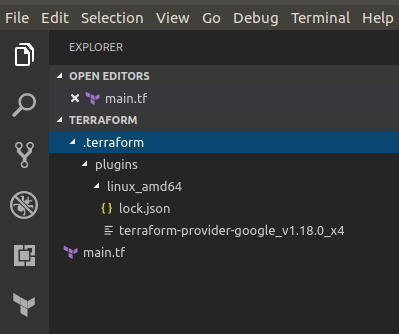

# Labtech Terraform

## Pré-requis Terraform

### Installation de Terraform

Pour le téléchargement se rendre sur [le site de terraform](https://www.terraform.io/downloads.html) et choisir le binaire selon votre OS.  
Mettre le chemin du binaire dans votre PATH (pas d'installation nécessaire):

- Windows : `setx path "%path%;c:\terrafrom"` par exemple

- Linux : `export PATH="$PATH:/home/mdrouet/terraform"` par exemple (et à ajouter dans votre /home/.bashrc)

Pour vérifier que votre installation est correcte, lancer un shell et exécuter : `terraform -version`.  
Vous devez avoir avoir une réponse du style : `Terraform v0.11.8`

### IDE

Plusieurs IDE sont compatibles avec terraform : Atom, JetBrain, Vi,...  
Perso, j'utilise Visual Code avec le plugin : `mauve.terraform`  
Ca vous facilitera le développement : autocomplétion, indentation auto, coloration syntaxique,...

## Pré-requis GCP

### Utiliser terraform avec son compte GCP

- Installer Google Cloud Shell : [ICI](https://cloud.google.com/sdk/)
  
- Lancer la commande suivante :

```cmd
gcloud auth application-default login
```

Utilisez vos identifiants Techsys O365 (si vous n'avez pas de compte techsys, utiliser votre compte Google)  
Vous obtiendrez les informations suivantes :

```cmd
Your browser has been opened to visit:

    https://accounts.google.com/o/oauth2/auth?redirect_uri=http%3A%2F%2Flocalhost%3A8085%2F&prompt=select_account&response_type=code&client_id=764086051850-6qr4p6gpi6hn506pt8ejuq83di341hur.apps.googleusercontent.com&scope=https%3A%2F%2Fwww.googleapis.com%2Fauth%2Fuserinfo.email+https%3A%2F%2Fwww.googleapis.com%2Fauth%2Fcloud-platform&access_type=offline

Credentials saved to file: [C:\Users\mdrouet\AppData\Roaming\gcloud\application_default_credentials.json]

These credentials will be used by any library that requests
Application Default Credentials.

To generate an access token for other uses, run:
  gcloud auth application-default print-access-token
```

### Utiliser terraform avec un compte de service

C'est la solution d'authentification préconisée par GCP/Terraform mais c'est moins pratique que d'utiliser son propre compte donc pour ce labtech, préférer la première solution. L'explication ci-dessous est disponible en cas de problème avec votre compte ou pour votre curiosité.

Si vous voulez utiliser la solution service account, il est nécéssaire d'avoir au moins déjà un projet dans lequel créer ce service account.
Il faut ensuite lui donner des permissions sur l'organisation afin qu'il puisse : Créer, supprimer et modifier des projets ainsi que les ressources associées.

Puisque dans notre cas, nous voulons créer aussi le projet par Terraform, j'ai créé un service account vous permettant d'effectuer les TPs.
J'ai déjà positionné les permissions sur l'organisation Techsys.
Voici le service account à utiliser : svcaccount-terraform@techsys-infrastructure.iam.gserviceaccount.com.
Le json d'authentification est disponible [ici.](https://console.cloud.google.com/storage/browser/techsys-infrastructure-terraform/). Il s'agit du fichier techsys-infrastructure-7225b741c637.json  
Bien entendu, seul les utilisateurs autorisés peuvent accéder à ce bucket et donc récupérer ce fichier.

#### Configuration de la variable d'environnement

Aprés avoir récupéré le json voir ci-dessus, il faut enregistrer la variable d'environnement :

- Windows : setx GOOGLE_CREDENTIALS "C:\terraform\authentication.json"

- Linux : export GOOGLE_CREDENTIALS="/home/mdrouet/Desktop/authentication.json"

## Premier déploiement

Créer un dossier TP0 (n'importe ou) et positionnez-vous dans ce dossier.  
Créer le fichier `main.tf`

__Attention, renommer dans tous les exercices yourname par votre nom pour différencier les projets.__

### Configurer votre provider

Il faut d'abord déclarer le provider pour décrire à terraform où déployer vos ressources.  
Modifier le fichier `main.tf` et ajouter :

```hcl
provider "google" {
  project = "techsys-labtech-tf-yourname" #optionel : permet uniquement de spécifier le projet qui sera utilisé par défaut lors des appels terraform. On y reviendra dans les autres exercices.
  region = "europe-west1"
  version = "1.18" # force la version à 1.18
}
```

Il existe d'autres attributs dans le bloc `provider` : [ICI](https://www.terraform.io/docs/providers/google/index.html) ;-)

### Déploiement de votre projet

Sur GCP, toute ressource créée nécessite un projet. Il est donc nécessaire de créer un projet avant tout.  
Ajouter dans le ficher `main.tf` :

```hcl
resource "google_project" "project-yourname" {
  name                = "labtech-tf-yourname"
  project_id          = "techsys-labtech-tf-yourname"
  billing_account     = "" # id du billing account
  folder_id           = "" # id du dossier où le projet doit être créé
  org_id              = "6892586500" # id de l'organisation techsys
  auto_create_network = "false" # Evite la création des réseaux par défaut qui ne sont pas nécessaires.
}
```

Maintenant que notre description est faite, nous pouvons exécuter terraform.  
Dans votre cmd ou shell, aller dans le dossier créé où se trouve votre fichier main.tf et éxécuter: `terraform init`.  

```cmd
terraform init


Initializing provider plugins...
- Checking for available provider plugins on https://releases.hashicorp.com...
- Downloading plugin for provider "google" (1.18.0)...

Terraform has been successfully initialized!

You may now begin working with Terraform. Try running "terraform plan" to see
any changes that are required for your infrastructure. All Terraform commands
should now work.

If you ever set or change modules or backend configuration for Terraform,
rerun this command to reinitialize your working directory. If you forget, other
commands will detect it and remind you to do so if necessary.

```

Cette commande est à lancer la première fois pour initialiser le répertoire.  
Durant cette commande, terraform télécharge automatiquement le plugin nécessaire au provider renseigné (pour l'OS utilisé) :  
  
Un fichier lock.json est aussi créé qui permettra de générer un lock sur le fichier **state**.  
Une fois initialisé, on peut lancer le `terraform plan` qui permet de vérifier l'éxécution de votre terraform.  
Cela permet de vérifier ce qui va être créé/modifié/supprimé sans que cela soit effectif.

```cmd
terraform plan

Refreshing Terraform state in-memory prior to plan...
The refreshed state will be used to calculate this plan, but will not be
persisted to local or remote state storage.


------------------------------------------------------------------------

An execution plan has been generated and is shown below.
Resource actions are indicated with the following symbols:
  + create

Terraform will perform the following actions:

  + google_project.project-yourname
      id:                  <computed>
      auto_create_network: "false"
      folder_id:           <computed>
      name:                "labtech-tf-yourname"
      number:              <computed>
      org_id:              <computed>
      policy_data:         <computed>
      policy_etag:         <computed>
      project_id:          "techsys-labtech-tf-yourname"
      skip_delete:         <computed>


Plan: 1 to add, 0 to change, 0 to destroy.

------------------------------------------------------------------------
```

Cela affichera des codes différents en fonction des modifications appliquées par le plan :  
`+` pour ce qui va être créé  
`-` pour ce qui va être détruit  
`~` pour ce qui va être mis à jour (pas de suppression)  

Dans notre cas, il s'agit seulement d'une création.
Vous pouvez ensuite lancer le `terrafrom apply` qui va cette fois exécuter le code et créé (dans notre cas) le projet.  

```cmd
terraform apply

An execution plan has been generated and is shown below.
Resource actions are indicated with the following symbols:
  + create

Terraform will perform the following actions:

  + google_project.project-yourname
      id:                  <computed>
      auto_create_network: "false"
      folder_id:           <computed>
      name:                "labtech-tf-yourname"
      number:              <computed>
      org_id:              <computed>
      policy_data:         <computed>
      policy_etag:         <computed>
      project_id:          "techsys-labtech-tf-yourname"
      skip_delete:         <computed>


Plan: 1 to add, 0 to change, 0 to destroy.

Do you want to perform these actions?
  Terraform will perform the actions described above.
  Only 'yes' will be accepted to approve.

  Enter a value: yes

google_project.project-yourname: Creating...
  auto_create_network: "" => "false"
  folder_id:           "" => "<computed>"
  name:                "" => "labtech-tf-yourname"
  number:              "" => "<computed>"
  org_id:              "" => "<computed>"
  policy_data:         "" => "<computed>"
  policy_etag:         "" => "<computed>"
  project_id:          "" => "techsys-labtech-tf-yourname"
  skip_delete:         "" => "<computed>"
google_project.project-yourname: Still creating... (10s elapsed)
................
google_project.project-yourname: Still creating... (3m20s elapsed)
google_project.project-yourname: Creation complete after 3m20s (ID: techsys-labtech-tf-yourname)

Apply complete! Resources: 1 added, 0 changed, 0 destroyed.
```

Lors du premier terraform apply, un fichier est créé : `terraform.tfsate`  
Ce fichier comprend toutes les modifications effectuées : c'est l'état de votre projet terraform.  
Il s'agit d'un fichier json et quand on l'ouvre, on voit toutes les informations liées aux ressources créées.  
Ici : le projet.

_La suite mardi soir_ !